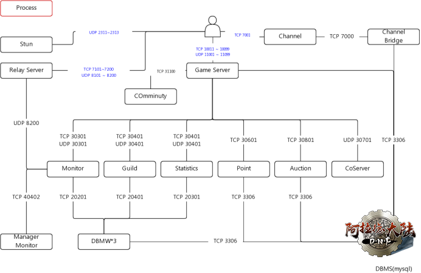

# 服务功能说明

## 官方文档

[点击查看官方文档](台服dnf服务架构.docx)

## 流程图



## 可共用服务

### relay

* 需要暴露外网
* 客户端间无法链接P2P时，作为中继
* 独立执行

```shell
relay:

    7200/tcp/udp
    ---->monitor:30303[将7200端口通知monitor]
```

### stun

* 需要暴露外网UDP
* P2P组队关键服务
* 以其他 NAT 堵塞的对等点之间可进行 P2P 通讯(UDP Hole puncing)
* 独立执行

```shell
stun: 

    2311/udp
    2312/udp
    2313/udp
```

### channel

* 需要暴露外网
* 从分流中继服务器确认分流情报
* 将分流信息传送至客户端

```shell
channel:

    7001/tcp/udp
    ----> bridge:7000
```

### bridge

* 分流信息档案的形成和传送 
* 从游戏服务器端收集分流资讯收集(分流开/关,在线人数)
* 收集外挂玩家物品概率等资讯
* 死亡之塔内排名作业
* 在网页上储值的D币变更套用

```shell
bridge:

    7000/tcp/udp
    db:
    d_channel
```

### community

* 决斗场相关服务器
* 决斗场 登录、注销历史发生

```shell
community:
    
    31100/tcp/udp
```

### coserver

* 阻止连重复线（全部GAME SERVER组）
* 独立执行

```shell
coserver:

    30703/tcp/udp
```

### manager

* 管理监控程序，游戏服务器邀请整个组传播消息
* 服务器组间传递消息（纳米项目）
* 在团体中集体活动

```shell
manager:

    40403/tcp/udp
```

## 大区独立配置服务

### auction

* 游戏内以拍卖场服务器启动资讯项目时，从db平台带过来 
* 拍卖场服务器将得标的物品寄出，通过监控服务器传送内容
* 游戏服务器结束时，收到传送的广播信号后，就会终止拍卖场的作用。
* 游戏服务器被启动的话,会自动运行 
* 程序下线时，拍卖场流标的信息可能会被损毁。
* 在网页上储值的D币变更套用

```shell
auction:

    30803/tcp/udp
    db:
    taiwan_cain_2nd
    taiwan_cain_auction_gold
    ---->monitor:30303
```

### point

* 和Auction SERVER一样的功能，可以使用现金进行交易，不是游戏内金币

```shell
point:
    
    30603/tcp/udp
    ---->monitor:30303
    db:
    taiwan_cain_2nd
    taiwan_cain_auction_cera
```

### monitor

* 服务器组间阻止重复登入
* 和朋友、同伴的聊天
* 登陆黑名单/ 朋友, 成员, 公会会员黑名单确认
* 将连线中的球员踢下线
* 邮件发送时、通知的功能 
* 服务器认证
* 游戏结束时,DB处理期间禁止连线
* 套用burning time活动等各种活动 (游戏服务器 消耗再启动)
* 收集外挂玩家物品概率等资讯
* 死亡之塔内排名作业
* 在网页上储值的D币变更套用

```shell
monitor:

    30303/udp
    ----->dbmw_mnt:20203
    ----->manager:40403
    ----->relay:7200
```

### guild

* 公会创立、加入、退出、解散时跨越公会服务器套用
```shell
guild:
    
    30403/tcp/udp
    ---->dbmw_guild:20403/tcp/udp
```

### statics

```shell
statics:

    30503/udp
```

### game

* 在Web认证帐号后,在游戏服务器上处理Login_out 
* 地下城等级和地下城内游戏进行处理
* 现金购买处理
* 创角、等级处理
* 出租 物品处理

```shell
game:

    用户自定义频道端口/tcp
    用户自定义频道端口/udp
    ---->monitor:30303
    ---->coserver:30703
    ---->statics:30503
    ---->guild:30403
    ---->channel:7000
    ---->auction:30803
    ---->point:30603
    ---->relay:7200
    db:
    d_taiwan
```

### dbmw_guild(guild)

* DB中间件作用执行
* 随着CFG变更，分为3种的DBMW
* 服务器认证
* 游戏结束时,DB处理期间禁止连线
* 套用burning time活动等各种活动 (游戏服务器 消耗再启动)

```shell
dbmw_guild:
    
    20403/tcp/udp
    db:
    d_taiwan
```

### dbmw_mnt(monitor)

* DB中间件作用执行
* 随着CFG变更，分为3种的DBMW
* 服务器认证
* 游戏结束时,DB处理期间禁止连线
* 套用burning time活动等各种活动 (游戏服务器 消耗再启动)

```shell
dbmw_mnt:

    20203/tcp/udp
    db:
    d_taiwan
```

### dbmw_stat(statics)

* DB中间件作用执行
* 随着CFG变更，分为3种的DBMW
* 服务器认证
* 游戏结束时,DB处理期间禁止连线
* 套用burning time活动等各种活动 (游戏服务器 消耗再启动)

```shell
dbmw_stat:

    20303/tcp/udp
    db:
    d_taiwan
```
